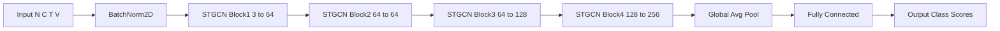

# ST-GCN Architecture Implementation

## Overview
PyTorch 기반으로 ST-GCN (Spatial-Temporal Graph Convolutional Network) 구조를 직접 구현하고,
더미 데이터를 통해 forward 흐름을 확인한 실습 코드입니다.

---

## 🏗 Model Architecture Diagram

---

## Model Structure
- Spatial Convolution (관절 간 관계 학습)
- Temporal Convolution (시간 축 학습)
- Residual Connection
- Batch Normalization
- Global Average Pooling
- Fully Connected Layer

---

## Input Format
Input shape: (N, C, T, V)

- N: Batch size  
- C: Coordinate channels (x, y, z)  
- T: Time frames  
- V: Number of joints  

Example:
(1, 3, 100, 25)

---

## Tech Stack
- Python
- PyTorch

---

## Purpose
ST-GCN 구조를 이해하고, Graph 기반 행동 인식 모델의 기본 흐름을 학습하기 위함.
